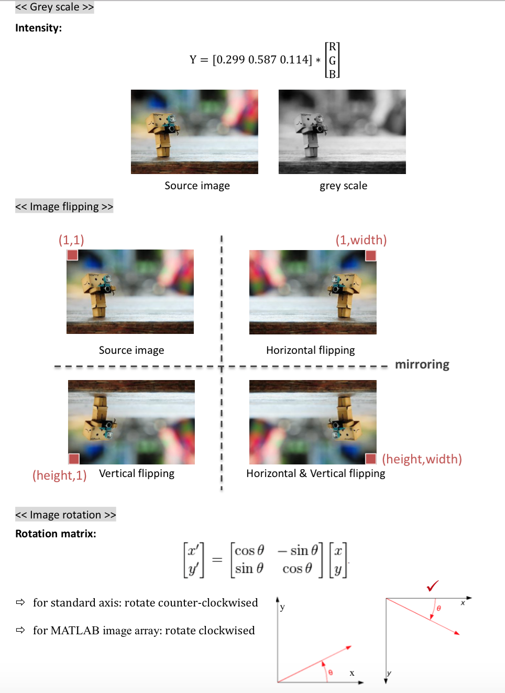
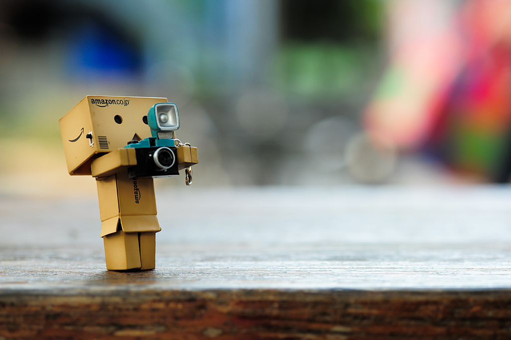
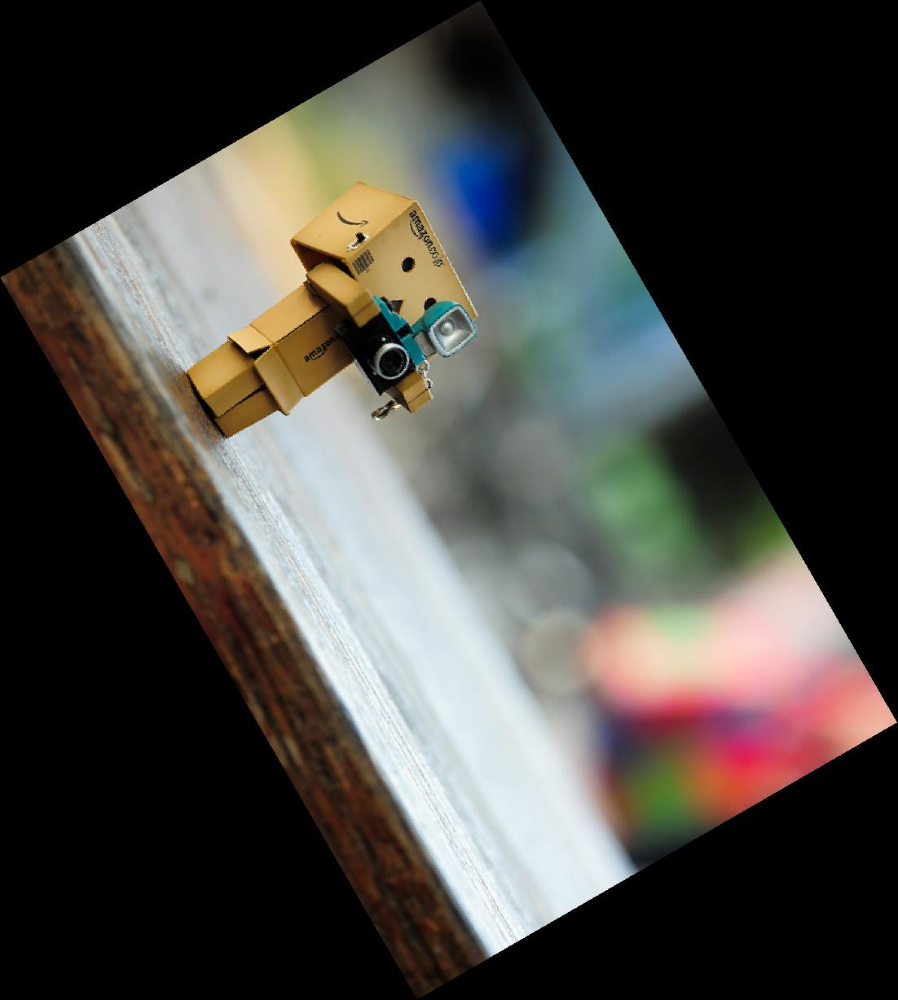

# Project Report EE16 黃翊 <span style="color:red">(101061250)</span>

# HW0 /  Pixel array manipulation

## Overview
The project is related to 
> To filp image horizontal, vertical and both of them;
> To rotate image at any angle;

## Implementation
 * image filpping
 
	1. I seperate the image into three channel(R, G, B) and process them individually.  
	2. By the giving information, I create the flipping algorithm by double for loop.
	</center>
	
	</center>

```
 1. horizontal
 
  for h = 1 : height
       for w = 1 : width 
             R_flip(h, w) = R(h, (width -w + 1)); 
             G_flip(h, w) = G(h, (width -w + 1));
             B_flip(h, w) = B(h, (width- w + 1));
       end
  end

  2. vertical
  
  for w = 1 : width
       for h = 1 : height 
             R_flip(h, w) = R( (height - h + 1), w ); 
             G_flip(h, w) = G( (height - h + 1) , w );
             B_flip(h, w) = B( (height- h + 1) , w );
       end
  end
	
  3. both
  
  for h = 1 : height
       for w = 1 : width 
             R_flip(h, w) = R((height - h + 1),(width - w + 1)); 
             G_flip(h, w) = G((height - h + 1),(width - w + 1));
             B_flip(h, w) = B((height - h + 1),(width - w + 1));
       end
  end
```
* image rotation 
	-step1. Constructing the rotation matrix and image vertex matrix and get new vertex.
	```
	matrix = [cos(radius) -sin(radius) ; sin(radius) cos(radius)];
	vertex = [1 width 1 width ;1 1 height height] ; % create an 2*4 matrix for rotation
	vertex_new = matrix * vertex;
	```

	-step2. find min x, min y, max x, max y.
	
	```
	min_x = min(vertex_new(1,:));
	max_x = max(vertex_new(1,:));
	max_y = max(vertex_new(2,:)); 
	min_y = min(vertex_new(2,:)); 
	```

	-step3. shift the image to the positive axis.

	```
	 x_shift = 1-min_x;  
	 y_shift = 1-min_y;
	```

	-step4. calculate new width and height.

	```
	 width_new = ceil(max_x) - floor(min_x);         
	 height_new = ceil(max_y) - floor(min_y);
	```

	-step5. back rapping 
	  1. If the back rapping point is inside of the source image, calculate r,g,b by interpolation.
	  2. else if it is outside of the source image , set r,g,b = 0;
```
	    if(x1== x2)
                wa = 1/2;
            else
                wa = (x_old-x1)/(x2-x1);
            end
            
             if(y1== y2)
                wb = 1/2;
             else
                wb = (y_old-y1)/(y2-y1);
             end
             
	    w1=(1-wa)*(1-wb);
            w2=wa*(1-wb);
            w3=wa*wb;
            w4=(1-wa)*wb;
            
             r = R(y1,x1)*w1 + R(y2,x1)*w2 + R(y2,x2)*w3 + R(y1,x2)*w4;
             g = G(y1,x1)*w1 + G(y2,x1)*w2 + G(y2,x2)*w3 + G(y1,x2)*w4;
             b = B(y1,x1)*w1 + B(y2,x1)*w2 + B(y2,x2)*w3 + B(y1,x2)*w4;
```


	 

		## Results


	  </center>
      	  
	  </center>
		<table border=1>
		<tr>
		<td>
		
		
		
		
		</td>
		</tr>

		

		</table>
	 </center>
     	
	  </center>
		<table border=1>
		<tr>
		<td>
		
		
		
		
		
		</td>
		</tr>

	

		</table>


