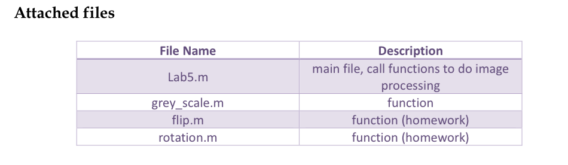

# Project Report EE16 黃翊 <span style="color:red">(101061250)</span>

# HW0 /  Pixel array manipulation

## Overview
The project is related to 
> To filp image horizontal, vertical and both of them;
> To rotate image at any angle;

## Implementation
1. image filpping
	</center>
	
	</center>
First, I seperate the image into three channel(R, G, B) and process them individually.  
Second, by the giving information, I create the flipping algorithm by double for loop.

		```
 <horizontal>
  for h = 1 : height
       for w = 1 : width 
             R_flip(h, w) = R(h, (width -w + 1)); 
             G_flip(h, w) = G(h, (width -w + 1));
             B_flip(h, w) = B(h, (width- w + 1));
       end
  end
		```
		```
  <vertical>
  for w = 1 : width
       for h = 1 : height 
             R_flip(h, w) = R( (height - h + 1), w ); 
             G_flip(h, w) = G( (height - h + 1) , w );
             B_flip(h, w) = B( (height- h + 1) , w );
       end
  end
		```
		```
  <both>
  for h = 1 : height
       for w = 1 : width 
             R_flip(h, w) = R((height - h + 1),(width - w + 1)); 
             G_flip(h, w) = G((height - h + 1),(width - w + 1));
             B_flip(h, w) = B((height - h + 1),(width - w + 1));
       end
  end
		```
	 
2. image rotation
	  	
	  <br>
	  
	  <br>

		```
		Code highlights
		```

		## Installation
		* Other required packages.
		* How to compile from source?

		### Results

		<table border=1>
		<tr>
		<td>
		
		
		
		
		</td>
		</tr>

		<tr>
		<td>
		
		
		
		
		</td>
		</tr>

		</table>


